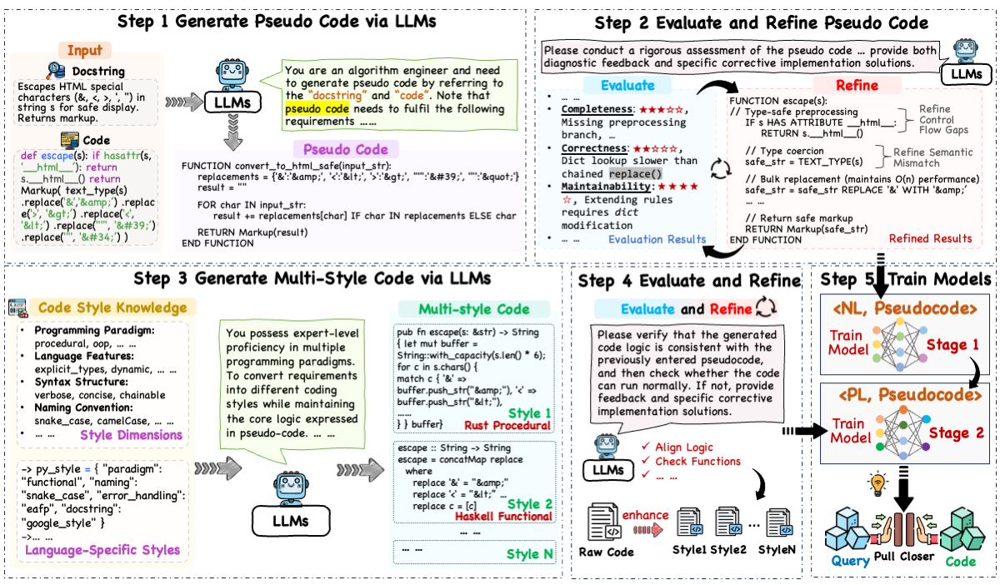

# PseudoBridge: Pseudo Code as the Bridge for Better Semantic and Logic Alignment in Code Retrieval


Code search aims to precisely find relevant code snippets that match natural language queries within massive codebases, playing a vital role in software development. 
Recent advances leverage pre-trained language models (PLMs) to bridge the semantic gap between unstructured natural language (NL) and structured programming languages (PL), yielding significant improvements over traditional information retrieval and early deep learning approaches. 
To address these issues, we propose **PseudoBridge**, a novel code retrieval framework that introduces pseudo-code as an intermediate, semi-structured modality to better align NL semantics with PL logic. 
Specifically, PseudoBridge consists of two stages: First, we employ an advanced large language model (LLM) to synthesize pseudo-code, enabling explicit alignment between NL queries and pseudo-code. Second, we introduce a logic-invariant code style augmentation strategy and employ the LLM to generate stylistically diverse yet logically equivalent code implementations with pseudo-code, then align the code snippets of different styles with pseudo-code, enhancing model robustness to code style variation. 
We build PseudoBridge across 10 different PLMs and evaluate it on 6 mainstream programming languages. 
Extensive experiments demonstrate that PseudoBridge consistently outperforms baselines, achieving significant gains in retrieval accuracy and generalization, particularly under zero-shot domain transfer scenarios such as [Solidity](https://zenodo.org/records/4587089#.YEog9-gzYuV) and [XLCoST](https://github.com/reddy-lab-code-research/XLCoST) datasets. 
These results demonstrate the effectiveness of explicit logical alignment via pseudo-code and highlight PseudoBridge’s potential as a robust, generalizable solution for code retrieval.



The framework of PseudoBridge, which comprises three core components: pseudo-code generation, logic-invariant code style enhancement, and model training. Step 1: Synthesize initial pseudo-code using LLMs. Step 2: Assess the quality of the generated pseudo-code and refine it. Step 3: Leverage the refined high-quality pseudo-code to produce syntactically diverse yet functionally equivalent code variants. Step 4: Evaluate the augmented code for logical correctness and quality, performing necessary refinement. Step 5: Utilize the generated pseudo-code, diversified code variants, and corresponding query to jointly train the target model.


## Usage

### Requirements
tokenizers==0.12.1

scikit-learn==1.1.2

tqdm==4.64.1

transformers==4.22.2

numpy==1.22.4

torch==1.10.1


## Datasets

**Stage 1: Pseudo Code Generation**

Generated using GPT-4o(2024-08-06). This dataset constructs corresponding pseudo-code from queries and code sourced from CodeXGLUE and Pytorrent. It encompasses six programming languages: **Python, Java, JavaScript, Go, Ruby, and PHP**. Details are available at `datasets/train/generated_datasets.jsonl`. You can run to generate the pseudo code.
```
python codeLAPSE/code/pseudo_code_gen.py
``` 
The following are the details of stage 1 train datasets.

|  Language  |  Number  |  From  |
|--------|--------|--------|
| Python | 3,000 | [Pytorrent](https://github.com/gallexis/pytorrent) |
| Python | 2,914 | [CodeXGLUE](https://github.com/microsoft/CodeXGLUE) |
| Java | 5,086 | CodeXGLUE |
| JavaScript | 5,000| CodeXGLUE |
| Go | 1,000 | CodeXGLUE |
| Ruby | 1,000 | CodeXGLUE |
| PHP | 1,000 | CodeXGLUE |


**Stage 2: Multi-Style Code Generation**

Generated using GPT-4o, based on the pseudo code from Stage 1. This stage produces four distinct stylistic variations of code for each (code, pseudo code, query) tuple in the dataset. These variations preserve logical invariance and functional consistency while altering only the coding style. Details are available at `datasets/train/generated_datasets.jsonl`.


## Baselines

Sentencebert: https://huggingface.co/sentence-transformers/all-mpnet-base-v2

DistilBert:
https://huggingface.co/distilbert/distilbert-base-multilingual-cased

RoBERTa: https://huggingface.co/FacebookAI/roberta-base

CodeBert: https://huggingface.co/microsoft/codebert-base

GraphCodeBert: https://huggingface.co/microsoft/graphcodebert-base

CodeT5: https://huggingface.co/Salesforce/codet5-base

CDCS: https://github.com/fewshotcdcs/CDCS

UniXcode: https://huggingface.co/microsoft/unixcoder-base

CoCoSoDa: https://huggingface.co/DeepSoftwareAnalytics/CoCoSoDa

RAPID: https://github.com/GuodongFan/Rapid


## Training
To train models with CodeLAPSE, run 

```
python CodeLAPSE/code/train_stage1.py
``` 

Based on the finetuned models of the Stage 1, run

```
python CodeLAPSE/code/train_stage2.py
``` 


## Evaluation
To evaluate the models, run:

```
python CodeLAPSE/code/evaluate.py
``` 

## License
MIT License


## Acknowledgements
Our code is inspired by [Setence-transformers](https://github.com/UKPLab/sentence-transformers/tree/master), [Hugging Face](https://huggingface.co/)