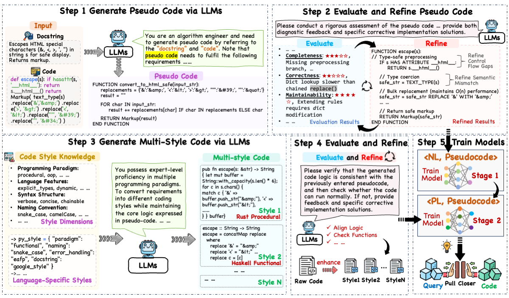

# PseudoBridge: Pseudo Code as the Bridge for Better Semantic and Logic Alignment in Code Retrieval


Code search aims to precisely find relevant code snippets that match natural language queries within massive codebases, playing a vital role in software development. 
Recent advances leverage pre-trained language models (PLMs) to bridge the semantic gap between unstructured natural language (NL) and structured programming languages (PL), yielding significant improvements over traditional information retrieval and early deep learning approaches. 
To address these issues, we propose **PseudoBridge**, a novel code retrieval framework that introduces pseudo-code as an intermediate, semi-structured modality to better align NL semantics with PL logic. 
Specifically, PseudoBridge consists of two stages: First, we employ an advanced large language model (LLM) to synthesize pseudo-code, enabling explicit alignment between NL queries and pseudo-code. Second, we introduce a logic-invariant code style augmentation strategy and employ the LLM to generate stylistically diverse yet logically equivalent code implementations with pseudo-code, then align the code snippets of different styles with pseudo-code, enhancing model robustness to code style variation. 
We build PseudoBridge across 10 different PLMs and evaluate it on 6 mainstream programming languages. 
Extensive experiments demonstrate that PseudoBridge consistently outperforms baselines, achieving significant gains in retrieval accuracy and generalization, particularly under zero-shot domain transfer scenarios such as [Solidity](https://zenodo.org/records/4587089#.YEog9-gzYuV) and [XLCoST](https://github.com/reddy-lab-code-research/XLCoST) datasets. 
These results demonstrate the effectiveness of explicit logical alignment via pseudo-code and highlight PseudoBridge’s potential as a robust, generalizable solution for code retrieval.



The framework of PseudoBridge, which comprises three core components: pseudo-code generation, logic-invariant code style enhancement, and model training. Step 1: Synthesize initial pseudo-code using LLMs. Step 2: Assess the quality of the generated pseudo-code and refine it. Step 3: Leverage the refined high-quality pseudo-code to produce syntactically diverse yet functionally equivalent code variants. Step 4: Evaluate the augmented code for logical correctness and quality, performing necessary refinement. Step 5: Utilize the generated pseudo-code, diversified code variants, and corresponding query to jointly train the target model.

---

## 🏗️ Framework Overview

The PseudoBridge pipeline consists of five critical steps:

1. **Pseudo-code Generation**: Generate initial pseudo-code from NL queries using LLMs.
2. **Evaluate and Refine Pseudo-code**: Evaluate and refine pseudo-code quality via a "Gatekeeper" mechanism.
3. **Multi-style Code Generation**: Produce syntactically diverse but logically equivalent code variants.
4. **Evaluate and Refine Code Variants**: Ensure logical correctness and quality of augmented variants.
5. **Semantic and Logic Alignment**: Jointly train the target model using (Query, Pseudo-Code, Code) triplets.

---

## 📋 Requirements

Ensure your environment meets the following dependencies:

```text
torch==1.10.1
transformers==4.22.2
tokenizers==0.12.1
scikit-learn==1.1.2
numpy==1.22.4
tqdm==4.64.1
```

---

## 📊 Datasets

The framework is evaluated on 6 core languages from [CodeSearchNet](https://github.com/microsoft/CodeXGLUE) and tested for generalization on [Solidity](https://www.google.com/search?q=https://zenodo.org/records/4587089) and [XLCoST](https://github.com/reddy-lab-code-research/XLCoST).

| Language | Training Samples | Source |
| --- | --- | --- |
| Python | 5,914 | CodeSearchNet |
| Java | 5,086 | CodeSearchNet |
| JavaScript | 5,000 | CodeSearchNet |
| Go | 1,000 | CodeSearchNet |
| Ruby | 1,000 | CodeSearchNet |
| PHP | 1,000 | CodeSearchNet |

| Language | Testing Samples | Source |
| --- | --- | --- |
| Python | 22,176 | CodeSearchNet |
| Java | 26,909 | CodeSearchNet |
| JavaScript | 6,483 | CodeSearchNet |
| Go | 14,291 | CodeSearchNet |
| Ruby | 2,279 | CodeSearchNet |
| PHP | 28,391 | CodeSearchNet |
| C++ | 899 | XLCoST |
| C# | 909 | XLCoST |
| Solidity | 1,000 | Solidity |
---

### 📂 Data Access
- **Sample Data**: For quick training and testing, we provide 300 sampled instances for both Stage 1 and Stage 2 in `data/train_sampled/`.
- **Test Samples**: Sampled test sets for all six languages (Go, Java, JavaScript, etc.) are available in the `data/test_sampled/` directory.
- **Full Dataset**: The complete training and testing dataset can be downloaded from [https://huggingface.co/datasets/yixuan1230/PseudoBridge/].

## 🛠️ Methodology

### 🔹 Stage 1: Pseudo-Code Generation

This stage constructs high-quality pseudo-code to bridge queries and source code.

* **Generator**: Drafts pseudo-code following strict formatting guidelines.
* **Evaluator**: Performs **Alignment Checks** (logical equivalence) and **Quality Scoring** (Correctness, Readability, Completeness, Conciseness, Maintainability).
* **Refiner**: Iteratively improves output based on specific Evaluator feedback.

**Run Generation:**

```bash
# Export API key if using API mode
export OPENAI_API_KEY="your_api_key"
# Execute pipeline
bash scr/pseudocode_gen/run.sh
```

### 🔹 Stage 2: Multi-Style Code Generation

We generate diverse Python variants for each logic triplet to ensure **logic-invariance**.

* **Six-Dimensional Style Matrix**: Includes permutations of Programming Paradigms, Language Features, Syntactic Structures, Naming Conventions, Error Handling, and Memory Management.
* **Logic-Invariant Loop**: Uses a shared model registry (vLLM) to generate and verify that augmented code remains functionally identical to the source.

**Run Augmentation:**

```bash
bash scr/codevariant_gen/run.sh
```

---

## 🚀 Usage Guide

### 1️⃣ Training Strategy

PseudoBridge employs a two-stage alignment process. Configure `config.py` (e.g., `STAGE`, `DATA_PATH`) before starting.

* **Phase 1 (NL ↔ Pseudo-Code)**: Build the logic bridge.
```bash
# Set STAGE = 1 in config.py
python main.py
```


* **Phase 2 (Pseudo-Code ↔ PL)**: Fine-tune for semantic-logic alignment using multi-style variants.
```bash
# Set STAGE = 2 in config.py
python main.py
```


*Note: The script is interactive; you can select specific models or high-quality labels (e.g., labels 3, 4) during execution.*

### 2️⃣ Evaluation

Evaluate performance using **MRR**, **Recall@k**, and **Avg Rank**.

```bash
python eval.py
```

**Interactive Workflow:**

1. Select source (Base vs. Finetuned).
2. Choose specific checkpoints/steps.
3. The script automatically discovers all `.jsonl` test files and generates an **Excel Report** (`.xlsx`) and raw **JSON** logs.

---

## ⚖️ Baselines

We compare PseudoBridge against various state-of-the-art encoders:

* **General**: [SentenceBERT](https://huggingface.co/sentence-transformers/all-mpnet-base-v2), [DistilBERT](https://huggingface.co/distilbert/distilbert-base-multilingual-cased), [RoBERTa](https://huggingface.co/FacebookAI/roberta-base).
* **Code-Specific**: [CodeBERT](https://huggingface.co/microsoft/codebert-base), [GraphCodeBERT](https://huggingface.co/microsoft/graphcodebert-base), [CodeT5](https://huggingface.co/Salesforce/codet5-base), [UniXcoder](https://huggingface.co/microsoft/unixcoder-base).
* **Advanced**: [CDCS](https://github.com/fewshotcdcs/CDCS), [CoCoSoDa](https://huggingface.co/DeepSoftwareAnalytics/CoCoSoDa), [RAPID](https://github.com/GuodongFan/Rapid).

---

## 📄 License & Acknowledgements

* **License**: This project is licensed under the MIT License.
* **Acknowledgements**: This work is inspired by and builds upon [Sentence-Transformers](https://github.com/UKPLab/sentence-transformers) and [Hugging Face Transformers](https://huggingface.co/).

